# Домашнее задание к занятию «Хранение в K8s. Часть 2»

### Задание 1

**Что нужно сделать**

Создать Deployment приложения, использующего локальный PV, созданный вручную.

1. Создать Deployment приложения, состоящего из контейнеров busybox и multitool.
2. Создать PV и PVC для подключения папки на локальной ноде, которая будет использована в поде.
3. Продемонстрировать, что multitool может читать файл, в который busybox пишет каждые пять секунд в общей директории. 
4. Удалить Deployment и PVC. Продемонстрировать, что после этого произошло с PV. Пояснить, почему.
5. Продемонстрировать, что файл сохранился на локальном диске ноды. Удалить PV.  Продемонстрировать что произошло с файлом после удаления PV. Пояснить, почему.
5. Предоставить манифесты, а также скриншоты или вывод необходимых команд.

------

### Задание 2

**Что нужно сделать**

Создать Deployment приложения, которое может хранить файлы на NFS с динамическим созданием PV.

1. Включить и настроить NFS-сервер на MicroK8S.
2. Создать Deployment приложения состоящего из multitool, и подключить к нему PV, созданный автоматически на сервере NFS.
3. Продемонстрировать возможность чтения и записи файла изнутри пода. 
4. Предоставить манифесты, а также скриншоты или вывод необходимых команд.

------

### Выполнение задания 1

Создание Deployment приложения, использующего локальный PV, созданный вручную.

1. Пишу манифест Deployment приложения, состоящего из контейнеров busybox и multitool.

Применяю Deployment и проверяю его статус:

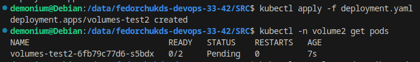

Статус пода в состоянии Pending. Если посмотреть через describe причину, то можно увидеть следующее:

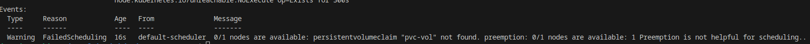

Под не запустился по причине отсутствия PVC с именем `pvc-vol`.

2. Пишу манифест PV и PVC для подключения папки на локальной ноде, которая будет использована в поде.

Применяю манифесты PV и PVC и проверяю их статусы:

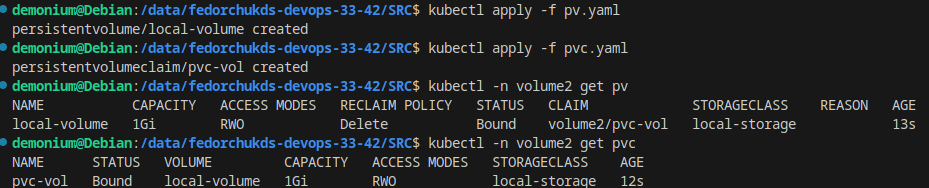

PV и PVC запущены.

Теперь проверю статус пода, который ожидал создания PVC с именем `pvc-vol`:

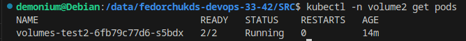

Под запущен.

3. Проверю, сможет ли multitool прочитать файл, в который busybox пишет данные каждые пять секунд в общей директории.

Проверить доступность файла можно из самого контейнера:

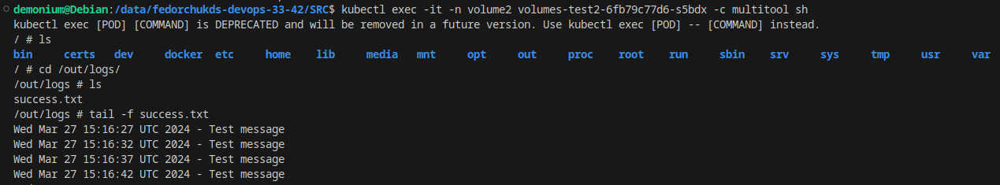

Также можно посмотреть логи самого контейнера в поде:

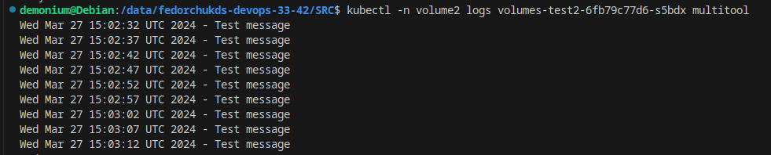

Multitool имеет доступ к файлу и может прочитать его.

4. Удаляю Deployment и PVC:

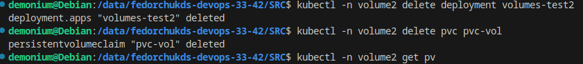

 Проверю, что после этого произошло с PV:

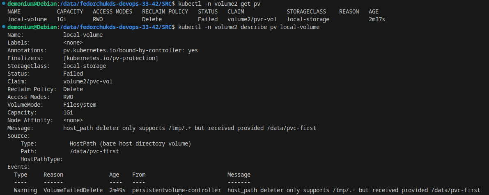

PV перешел в состояние Failed, т.к. контроллер PV не сумел удалить данные по пути `/data/pvc-first`. По умолчанию он может удалить только данные по пути /tmp. Если бы там находились файлы, то они были бы утеряны.

Если PVC не удалять, а удалить только Deployment, то PV будет в статусе "Bound"

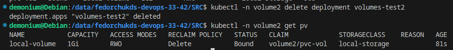

5. Проверю, сохранился ли файл на локальном диске ноды:

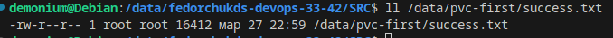

Файл присутствует в директории `/data/pvc-first`.

Удаляю PV:

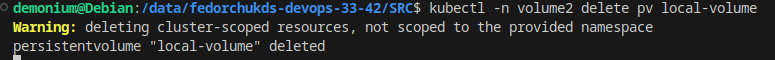

После удаления PV, файл в директории `/data/pvc-first` останется на месте из-за особенностей работы контроллера PV с hostPath. В случае если в манифесте PV политика persistentVolumeReclaimPolicy будет установлена в Recycle, то файл будет удален.

6. Ссылка на манифест https://github.com/osipovtema/K8s5/tree/main/SRC

------

### Выполнение задания 2

Создание Deployment приложения, которое может хранить файлы на NFS с динамическим созданием PV.

1. Устанавливаю и настраиваю NFS-сервер на ноде с MicroK8S:

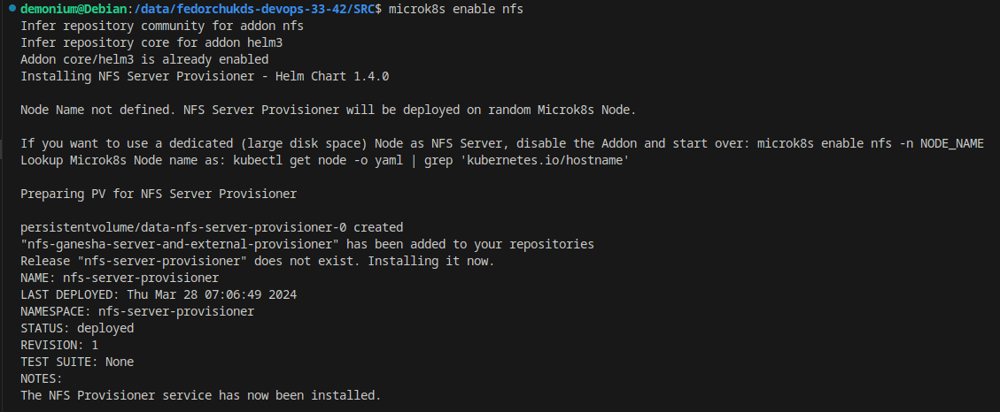

2. Пишу манифест Deployment приложения состоящего из multitool:

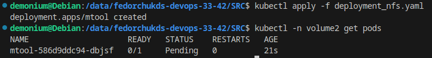

Так как в манифесте я указал использование NFS сервера, но еще не создал PVC, то под будет находиться в режиме ожидания.

Проверю PV, вижу, что он создан автоматически:

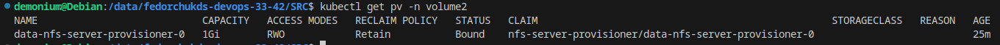

Пишу манифест PVC и применяю его, а также посмотрю состояние пода:

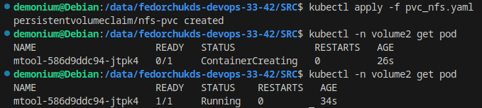

При появлении PVC с именем, указанным в манифесте Deployment, под запускается и переходит в режим готовности.

3. Проверю возможность чтения и записи файла изнутри пода. Для этого войду в оболочку контейнера пода и создам файл:

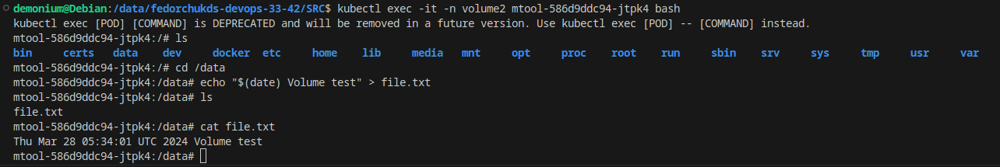

Через describe pv проверю, по какому пути смонтирована NFS директория:

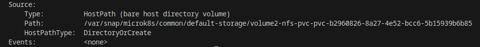

Если перейти в эту директорию, то можно увидеть созданный из контейнера пода файл:

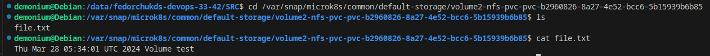

Это говорит о том, что NFS работает и из пода файл доступен для чтения и записи.

4. Ссылка на манифест https://github.com/osipovtema/K8s5/tree/main/SRC
